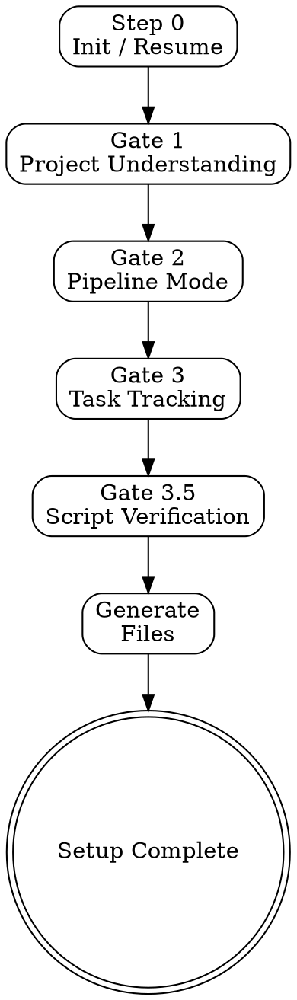

# pm-core Phase Alpha Implementation Plan

> **For Claude:** REQUIRED SUB-SKILL: Use superpowers:executing-plans to implement this plan task-by-task.

**Goal:** Create the pm-core plugin with wizard Gates 1-3.5 that audits a project, configures backlog integration (GitHub + BACKLOG.md), generates and tests shell scripts.

**Architecture:** Plugin at `plugins/pm-core/` with 1 skill (orchestrator), 3 agents, 5 references, 2 commands. Wizard generates scripts/commands in target project's `.claude/` directory.

**Tech Stack:** Claude Code plugin (markdown), bash scripts, gh CLI, git

## File Map

```
plugins/pm-core/
├── .claude-plugin/plugin.json              # Task 1
├── skills/
│   └── project-setup/
│       ├── SKILL.md                        # Task 8
│       └── references/
│           ├── standard-patterns.md        # Task 2
│           ├── architecture-audit.md       # Task 3
│           ├── backlog-strategies.md       # Task 5
│           └── script-testing.md           # Task 6
├── commands/
│   ├── setup.md                            # Task 9
│   └── upgrade.md                          # Task 9
└── agents/
    ├── architecture-auditor.md             # Task 4
    └── script-tester.md                    # Task 7
```

---

### Task 1: Plugin Scaffold

**Files:**
- Create: `plugins/pm-core/.claude-plugin/plugin.json`
- Modify: `.claude-plugin/marketplace.json`

**Step 1: Create plugin directory structure**

Run:
```bash
mkdir -p plugins/pm-core/.claude-plugin
mkdir -p plugins/pm-core/skills/project-setup/references
mkdir -p plugins/pm-core/commands
mkdir -p plugins/pm-core/agents
```

**Step 2: Create plugin.json**

```json
{
  "name": "pm-core",
  "version": "0.1.0",
  "description": "Project management meta-tool: analyzes projects and generates customized dev-skills, agents, commands, and quality gates",
  "author": {
    "name": "Marisko"
  },
  "homepage": "https://github.com/maselious/ai-marketplace",
  "keywords": ["pm", "project-management", "wizard", "meta-tool", "conductor", "parallel"]
}
```

**Step 3: Add to marketplace.json**

Add to `plugins` array in `.claude-plugin/marketplace.json`:
```json
{
  "name": "pm-core",
  "source": "./plugins/pm-core",
  "description": "Project management meta-tool: analyzes projects and generates customized dev-skills, agents, commands, and quality gates",
  "version": "0.1.0",
  "author": {
    "name": "Marisko"
  }
}
```

**Step 4: Commit**

```bash
git add plugins/pm-core/.claude-plugin/plugin.json .claude-plugin/marketplace.json
git commit -m "🎉 Scaffold pm-core plugin with manifest and marketplace entry"
```

---

### Task 2: Standard Patterns Reference

Foundation reference used by all generated commands and scripts.

**Files:**
- Create: `plugins/pm-core/skills/project-setup/references/standard-patterns.md`

**Step 1: Create standard-patterns.md**

```markdown
# Standard Patterns

Patterns for generated commands and scripts. Load this for consistent behavior across all generated artifacts.

## Preflight Checklist

Every generated command includes preflight validation. Silent — do not report progress to user. Just check and proceed or fail fast.

1. **Input validation** — arguments present, correct format
2. **Environment check** — required tools available, auth verified
3. **State check** — required files exist (`.claude/pm/config.yaml`, etc.)
4. **Datetime capture** — `current_dt=$(date -u +"%Y-%m-%dT%H:%M:%SZ")`

## Error Format

Standardized messages:
- `❌ {What failed}: {How to fix}`
- `⚠️ {Warning}: {What to consider}`
- `✅ {What succeeded}`

Example: `❌ gh not authenticated: Run gh auth login`

## Output Format

Commands end with structured summary:

    ✅ {Action completed}

    📊 Summary:
       Key1: Value1
       Key2: Value2

    🔗 Next: {suggested next command}

## Generated File Header

All files generated by pm-core start with:

    # Generated by pm-core v{version} on {date}
    # Source template: {template_name}
    # Modify freely — /pm:upgrade will detect changes and ask before overwriting

## Datetime

Always use ISO 8601 UTC: `date -u +"%Y-%m-%dT%H:%M:%SZ"`
Never use placeholder dates. Capture in variable before use.

## Frontmatter Stripping

Before posting markdown content to GitHub issues:

    # Strip YAML frontmatter (everything between first two --- lines)
    body=$(sed '1{/^---$/!q;};1,/^---$/d' "$file")

Preserve frontmatter locally — only strip for external publishing.

## Repository Protection

Before any GitHub write operation, check remote:

    remote_url=$(git remote get-url origin 2>/dev/null || echo "")
    if [[ "$remote_url" == *"maselious/ai-marketplace"* ]]; then
      echo "❌ Cannot sync to plugin marketplace repository"
      exit 1
    fi
```

**Step 2: Commit**

```bash
git add plugins/pm-core/skills/project-setup/references/standard-patterns.md
git commit -m "📝 Add standard-patterns reference for pm-core"
```

---

### Task 3: Architecture Audit Reference

Loaded by SKILL.md during Gate 1. Tells the wizard HOW to audit a project.

**Files:**
- Create: `plugins/pm-core/skills/project-setup/references/architecture-audit.md`

**Step 1: Create architecture-audit.md**

```markdown
# Architecture Audit Guide

Instructions for analyzing project architecture during Gate 1. Dispatch the `architecture-auditor` agent with these patterns.

## Step 1: Detect Stack

Check project root for framework indicators:

| File | Stack Signal |
|------|-------------|
| `package.json` + `nest-cli.json` | NestJS |
| `package.json` + `@nestjs/core` in deps | NestJS |
| `package.json` + `next.config.*` | Next.js |
| `package.json` + `vite.config.*` | Vite (React/Vue/Svelte) |
| `package.json` + `nuxt.config.*` | Nuxt |
| `pyproject.toml` or `requirements.txt` | Python |
| `go.mod` | Go |
| `Cargo.toml` | Rust |

Read main config for: framework version, key dependencies (ORM, auth, queue), TypeScript strict mode, build tool.

## Step 2: Detect Architecture Pattern

Scan `src/` (or equivalent) directory structure:

| Pattern | Directory Indicators |
|---------|---------------------|
| Clean Architecture | `domain/`, `infrastructure/`, `application/`, `interface/` |
| Modular Monolith | `modules/` with controller+service+entity per module |
| FSD (Feature-Sliced) | `routes/` or `pages/` + `features/` + `entities/` + `shared/` |
| MVC | `controllers/` + `services/` + `models/` |
| Flat | No clear structure |

## Step 3: Map Directories to Layers

**Clean Architecture:**

| Layer | Typical Path | Contains |
|-------|-------------|----------|
| Domain | `src/domain/` | Entities, abstract repositories, events, value objects |
| Application | `src/application/` | CQRS handlers, services, event handlers |
| Infrastructure | `src/infrastructure/` | Repository implementations, external adapters |
| Interface | `src/interface/` | Controllers, DTOs, guards, middleware |

**FSD:**

| Layer | Typical Path | Contains |
|-------|-------------|----------|
| Routes/Pages | `src/routes/` or `src/pages/` | Page components, layouts |
| Widgets | `src/widgets/` | Composite UI blocks |
| Features | `src/features/` | Business logic + UI |
| Entities | `src/entities/` | Data models + base UI |
| Shared | `src/shared/` | UI kit, utilities, API client |

For unrecognized patterns: scan tree, present findings, let user confirm.

## Step 4: Detect Existing .claude/ Setup

Check for:
- `.claude/skills/*/SKILL.md` — existing skills (list names)
- `.claude/agents/*.md` — existing agents (list names)
- `.claude/commands/*.md` — existing commands (list names)
- `.claude/hooks/hooks.json` — hooks configured
- `CLAUDE.md` — project instructions (note presence + size)

## Step 5: Detect Conflict Zones

Shared directories where parallel streams would conflict:

    # Find shared imports (TypeScript example)
    grep -r "from.*shared/" src/ --include="*.ts" -l 2>/dev/null | wc -l
    grep -r "from.*common/" src/ --include="*.ts" -l 2>/dev/null | wc -l

Flag:
- `shared/` or `common/` directories (shared types, utilities)
- Barrel exports (`index.ts` aggregating multiple modules)
- DI container registration files
- Migration files with sequential numbering

## Step 6: Parallel Readiness Score

| Criteria | Points |
|----------|--------|
| Clear layer separation | +2 |
| No circular dependencies between layers | +2 |
| Few shared files (<10) | +1 |
| Strong typing (TypeScript strict) | +1 |
| Existing test infrastructure | +1 |
| Many shared files (>20) | -2 |
| Circular dependencies detected | -3 |
| No clear layer separation | -3 |

- Score ≥ 5: recommend parallel
- Score 3-4: parallel with restrictions (serialize conflict zones)
- Score < 3: recommend sequential

## Output Format

    📊 Architecture Audit Results

    Stack: {framework} {version} + {ORM} + {language}
    Architecture: {pattern} ({layer_count} layers)
    ORM: {orm} ({database})

    Layers:
      {layer}: {path} ({module_count} modules)
      ...

    Existing .claude/:
      Skills: {list or "none"}
      Agents: {list or "none"}

    Conflict zones: {paths} ({file_count} files)
    Parallel readiness: {score}/10 — {recommendation}
```

**Step 2: Commit**

```bash
git add plugins/pm-core/skills/project-setup/references/architecture-audit.md
git commit -m "📝 Add architecture-audit reference for pm-core Gate 1"
```

---

### Task 4: Architecture Auditor Agent

**Files:**
- Create: `plugins/pm-core/agents/architecture-auditor.md`

**Step 1: Create architecture-auditor.md**

```markdown
---
name: architecture-auditor
description: "Use this agent to analyze project architecture for pm-core wizard. Detects stack, framework, layers, existing .claude/ setup, conflict zones, and parallel readiness.\n\n<example>\nContext: User runs /pm:setup for the first time\nuser: \"/pm:setup\"\nassistant: \"Launching architecture-auditor to analyze your project.\"\n<commentary>\nGate 1 requires architecture analysis — dispatch this agent.\n</commentary>\n</example>\n\n<example>\nContext: User wants to check parallel readiness\nuser: \"Can this project use parallel streams?\"\nassistant: \"Let me use architecture-auditor to assess readiness.\"\n<commentary>\nParallel readiness is part of architecture audit.\n</commentary>\n</example>\n\n<example>\nContext: User runs /pm:upgrade after structural changes\nuser: \"/pm:upgrade\"\nassistant: \"Re-auditing architecture to detect changes.\"\n<commentary>\nUpgrade needs fresh audit to detect drift.\n</commentary>\n</example>"
model: sonnet
color: purple
tools:
  - Glob
  - Grep
  - Read
  - Bash
---

# Architecture Auditor

Analyze project architecture for pm-core wizard. Read-only — never modifies project files.

## Bootstrap

Read `references/architecture-audit.md` from the pm-core plugin for detailed patterns.

## Process

### Step 1: Stack Detection

Scan project root for framework files. Read `package.json` (or equivalent) for dependencies and versions.

### Step 2: Architecture Pattern

Scan `src/` directory structure. Match against known patterns: Clean Architecture, Modular Monolith, FSD, MVC.

### Step 3: Layer Mapping

For each detected layer: directory path, module count, key patterns (base classes, decorators).

### Step 4: Existing .claude/ Setup

List all existing skills, agents, commands, hooks, CLAUDE.md presence.

### Step 5: Conflict Zone Detection

Find shared directories imported by multiple layers. Count shared files.

### Step 6: Parallel Readiness Score

Score 0-10 based on criteria in audit reference. Provide recommendation.

## Output

Return structured audit report matching the format in `references/architecture-audit.md`.
Include all data needed for wizard state caching: stack, arch, layers, existing_skills, conflict_zones, parallel_score.
```

**Step 2: Commit**

```bash
git add plugins/pm-core/agents/architecture-auditor.md
git commit -m "🤖 Add architecture-auditor agent for pm-core"
```

---

### Task 5: Backlog Strategies Reference

Loaded by SKILL.md during Gate 3. Covers GitHub integration, BACKLOG.md, and script templates.

**Files:**
- Create: `plugins/pm-core/skills/project-setup/references/backlog-strategies.md`

**Step 1: Create backlog-strategies.md**

```markdown
# Backlog Strategies

Instructions for setting up task tracking during Gate 3.

## BACKLOG.md Template

Always available, no external dependencies. Generate at `.claude/pm/BACKLOG.md`:

    # Project Backlog

    ## Active
    <!-- Current work items -->

    ## Ready
    <!-- Prioritized items ready to start -->

    ## Blocked
    <!-- Items waiting on dependencies -->

    ## Done
    <!-- Recently completed (last 10) -->

## GitHub Integration (Built-in)

### Discovery

    # Check gh CLI available
    which gh || echo "❌ gh not found: https://cli.github.com"

    # Check auth
    gh auth status || echo "❌ Not authenticated: gh auth login"

    # Check repo access
    gh repo view --json name,owner,url || echo "❌ No repo access"

### Label Setup

    gh label create "pm:epic" --color "0052CC" --description "Epic-level task" 2>/dev/null || true
    gh label create "pm:task" --color "1D76DB" --description "Individual task" 2>/dev/null || true
    gh label create "pm:in-progress" --color "FBCA04" --description "In progress" 2>/dev/null || true
    gh label create "pm:blocked" --color "D93F0B" --description "Blocked" 2>/dev/null || true

### Capabilities After Setup

| Stage | Method | Command |
|-------|--------|---------|
| Sync | `gh issue comment` | `scripts/pm-sync.sh` |
| Status | `gh issue list` | inline in `commands/pm-status.md` |
| Next | `gh issue list --label` | inline in `commands/pm-next.md` |
| Standup | `gh issue list --since` | inline in `commands/pm-standup.md` |
| Close | `gh issue close` | `scripts/pm-close.sh` |

## Tech/Business Split

If user separates technical and business tasks:
- Technical → GitHub Issues (default) or BACKLOG.md
- Business → ask user for tool (Notion, Linear, etc.)
- External tools: check MCP servers, CLIs. If nothing found → BACKLOG.md fallback

## Script Templates

### pm-sync.sh

    #!/usr/bin/env bash
    set -euo pipefail
    # pm-sync.sh — Sync local progress to GitHub Issues
    # Generated by pm-core v{version} on {date}

    ISSUE="${1:?Usage: pm-sync.sh <issue_number>}"

    # Preflight
    gh auth status >/dev/null 2>&1 || { echo "❌ gh not authenticated"; exit 1; }

    # Check remote protection
    remote_url=$(git remote get-url origin 2>/dev/null || echo "")
    if [[ "$remote_url" == *"maselious/ai-marketplace"* ]]; then
      echo "❌ Cannot sync to plugin marketplace repo"; exit 1
    fi

    # Build progress body
    STATE=".claude/pm/current-epic/state.yaml"
    if [ -f "$STATE" ]; then
      BODY=$(sed '1{/^---$/!q;};1,/^---$/d' "$STATE")
    else
      BODY="Progress update from local development."
    fi

    gh issue comment "$ISSUE" --body "$BODY"
    echo "✅ Synced to issue #$ISSUE"

### pm-close.sh

    #!/usr/bin/env bash
    set -euo pipefail
    # pm-close.sh — Close issue and clean up labels
    # Generated by pm-core v{version} on {date}

    ISSUE="${1:?Usage: pm-close.sh <issue_number>}"

    gh auth status >/dev/null 2>&1 || { echo "❌ gh not authenticated"; exit 1; }
    gh issue close "$ISSUE"
    gh issue edit "$ISSUE" --remove-label "pm:in-progress" 2>/dev/null || true
    echo "✅ Closed issue #$ISSUE"

### test-setup.sh

    #!/usr/bin/env bash
    set -euo pipefail
    # test-setup.sh — Verify pm-core generated setup
    # Generated by pm-core v{version} on {date}

    echo "🧪 pm-core Setup Verification"
    echo "=============================="
    PASS=0; FAIL=0

    check() {
      if eval "$1" >/dev/null 2>&1; then
        echo "  ✅ $2"; ((PASS++))
      else
        echo "  ❌ $2"; ((FAIL++))
      fi
    }

    echo ""; echo "Platform:"
    check "bash --version" "bash available"
    check "git --version" "git available"

    echo ""; echo "Scripts:"
    for s in .claude/scripts/*.sh; do
      [ -f "$s" ] || continue
      name=$(basename "$s")
      check "test -x '$s'" "$name executable"
      check "bash -n '$s'" "$name syntax"
      check "! file '$s' | grep -q CRLF" "$name line endings"
    done

    echo ""; echo "=============================="
    echo "Results: $PASS passed, $FAIL failed"
    [ "$FAIL" -eq 0 ] && echo "✅ All passed" || echo "❌ $FAIL checks failed"
    exit "$FAIL"

## Generated Command Templates

### pm-sync.md (delegates to script)

    ---
    name: pm-sync
    description: Sync local progress to GitHub Issues
    argument-hint: "<issue_number>"
    ---

    Sync current work progress to a GitHub issue as a comment.

    Run: `.claude/scripts/pm-sync.sh $ARGUMENTS`

    If script not found, tell user: "❌ pm-sync.sh not found. Re-run /pm:setup"

### pm-status.md (inline)

    ---
    name: pm-status
    description: Show current project management state
    ---

    Read and display:
    1. `.claude/pm/config.yaml` — active integrations
    2. `.claude/pm/current-epic/state.yaml` — current work (if exists)
    3. Recent GitHub issues: `gh issue list --label "pm:in-progress" --limit 5`

    Format as structured summary.

### pm-close.md (delegates to script)

    ---
    name: pm-close
    description: Close a task or epic
    argument-hint: "<issue_number>"
    ---

    Close a GitHub issue and clean up labels.

    Run: `.claude/scripts/pm-close.sh $ARGUMENTS`
```

**Step 2: Commit**

```bash
git add plugins/pm-core/skills/project-setup/references/backlog-strategies.md
git commit -m "📝 Add backlog-strategies reference with script templates"
```

---

### Task 6: Script Testing Reference

Loaded by SKILL.md during Gate 3.5. Covers platform detection, validation, smoke tests.

**Files:**
- Create: `plugins/pm-core/skills/project-setup/references/script-testing.md`

**Step 1: Create script-testing.md**

```markdown
# Script Testing

Verification patterns for generated shell scripts during Gate 3.5.

## Platform Detection

    os=$(uname -s)
    case "$os" in
      Linux*)  platform="linux" ;;
      Darwin*) platform="mac" ;;
      MINGW*|MSYS*|CYGWIN*) platform="windows-native" ;;
      *) platform="unknown" ;;
    esac

    # Detect WSL
    if grep -qi microsoft /proc/version 2>/dev/null; then
      platform="windows-wsl"
    fi

    # Check git autocrlf
    autocrlf=$(git config core.autocrlf || echo "not set")
    if [ "$autocrlf" = "true" ]; then
      echo "⚠️ core.autocrlf=true may corrupt scripts"
      echo "Recommend: git config core.autocrlf input"
    fi

## .gitattributes

Generate at `.claude/.gitattributes`:

    *.sh text eol=lf
    *.yaml text eol=lf

## Validation Steps

### Permissions

    chmod +x .claude/scripts/*.sh

### Syntax Check

    for script in .claude/scripts/*.sh; do
      bash -n "$script" 2>&1 && echo "✅ $(basename $script)" || echo "❌ $(basename $script)"
    done

### Line Endings

    for script in .claude/scripts/*.sh; do
      if file "$script" | grep -q CRLF; then
        sed -i 's/\r$//' "$script"
        echo "Fixed CRLF → LF: $(basename $script)"
      fi
    done

## Integration Smoke Tests

### GitHub

    # Create test issue
    test_id=$(gh issue create \
      --title "pm-core-smoke-test-$(date +%s)" \
      --label "pm:task" \
      --body "Automated smoke test — will be deleted" \
      --json number -q .number)

    # Test sync
    .claude/scripts/pm-sync.sh "$test_id"

    # Test close
    .claude/scripts/pm-close.sh "$test_id"

    # Cleanup
    gh issue delete "$test_id" --yes 2>/dev/null || \
      gh issue edit "$test_id" --add-label "pm-test-cleanup"

### BACKLOG.md

    # Verify structure
    for section in "Active" "Ready" "Blocked" "Done"; do
      grep -q "## $section" ".claude/pm/BACKLOG.md" || echo "❌ Missing: ## $section"
    done

## Iteration Protocol

If any test fails:
1. Read error output
2. Read the failing script source
3. Identify root cause
4. Fix the script
5. Re-run only the failed test
6. Max 3 attempts per script — then escalate to user
```

**Step 2: Commit**

```bash
git add plugins/pm-core/skills/project-setup/references/script-testing.md
git commit -m "📝 Add script-testing reference for Gate 3.5 verification"
```

---

### Task 7: Script Tester Agent

**Files:**
- Create: `plugins/pm-core/agents/script-tester.md`

**Step 1: Create script-tester.md**

```markdown
---
name: script-tester
description: "Use this agent to verify generated shell scripts work correctly. Tests syntax, line endings, permissions, and runs integration smoke tests. Iterates on failures.\n\n<example>\nContext: Wizard generated scripts in Gate 3, now Gate 3.5 needs verification\nuser: (dispatched by wizard)\nassistant: \"Testing all scripts in .claude/scripts/\"\n<commentary>\nGate 3.5 dispatches this agent after script generation.\n</commentary>\n</example>\n\n<example>\nContext: A script failed smoke test and needs fixing\nuser: \"pm-sync.sh failed: gh auth error\"\nassistant: \"Analyzing error, fixing script, retesting.\"\n<commentary>\nAgent iterates: diagnose → fix → retest.\n</commentary>\n</example>\n\n<example>\nContext: User wants to re-verify scripts after manual edits\nuser: \"Test my pm scripts\"\nassistant: \"Running script verification suite.\"\n<commentary>\nCan be invoked standalone for re-verification.\n</commentary>\n</example>"
model: sonnet
color: orange
tools:
  - Bash
  - Read
  - Write
  - Glob
---

# Script Tester

Verify generated shell scripts during pm-core wizard Gate 3.5.

## Bootstrap

Read `references/script-testing.md` from the pm-core plugin for validation patterns.

## Process

### Step 1: Platform Check

Detect OS, shell, WSL, git autocrlf. Report findings.

### Step 2: Fix Permissions and Line Endings

Set `chmod +x` on all `.claude/scripts/*.sh`. Check for CRLF and fix to LF.

### Step 3: Syntax Validation

Run `bash -n` on every script. Report pass/fail per file.

### Step 4: Run test-setup.sh

Execute `.claude/scripts/test-setup.sh` if it exists. Capture output.

### Step 5: Integration Smoke Tests

Based on configured integrations (read `.claude/pm/config.yaml`):
- GitHub: create test issue → sync → close → cleanup
- BACKLOG.md: verify structure

### Step 6: Handle Failures

For each failed test:
1. Analyze error output
2. Read failing script
3. Apply fix
4. Re-run failed test only
5. After 3 failed attempts: report to wizard with full error details

## Output

    🧪 Script Verification Results

    Platform: {os} / bash {version} / autocrlf={value}
    Scripts tested: {count}

    Validation:
      ✅ pm-sync.sh — syntax, permissions, line endings
      ✅ pm-close.sh — syntax, permissions, line endings
      ✅ test-setup.sh — syntax, permissions, line endings

    Integration:
      ✅ GitHub smoke test — create/sync/close/cleanup
      ✅ BACKLOG.md structure — all sections present

    Overall: PASS ({N}/{N} tests)
```

**Step 2: Commit**

```bash
git add plugins/pm-core/agents/script-tester.md
git commit -m "🤖 Add script-tester agent for Gate 3.5 verification"
```

---

### Task 8: Project-Setup SKILL.md

The core wizard controller. Orchestrator type following skill-forge conventions.

**Files:**
- Create: `plugins/pm-core/skills/project-setup/SKILL.md`

**Step 1: Create SKILL.md**

```markdown
---
name: project-setup
description: Use when setting up pm-core in a new project, generating dev-skills ecosystem, or configuring project management pipeline. Triggers on 'pm setup', 'setup project', 'generate dev skills', 'configure pipeline', 'project wizard'.
---

# Project Setup Wizard — pm-core Meta-Tool

## Overview

Analyze a project and generate customized dev-skills, agents, commands, and quality gates. Interactive wizard with 7 gates (Phase Alpha: Gates 1-3.5). Principle: generate once, run independently.



## Process

### Step 0: Initialize / Resume

Check for existing wizard state:

| Condition | Action |
|-----------|--------|
| No `.claude/pm-setup-state.yaml` | Create state file, add to `.gitignore`, start Gate 1 |
| State exists, gate incomplete | Resume from `current_gate` |
| State exists, all complete | Ask: re-generate or skip? |

Create initial state with platform detection:

    wizard_version: "0.1.0"
    started: {current_datetime}
    current_gate: 1
    platform:
      os: {uname -s result}
      shell: bash
      wsl: {true if microsoft in /proc/version}
      autocrlf: {git config core.autocrlf}
    gates: {}

Add to `.gitignore` if not present: `.claude/pm-setup-state.yaml` and `.claude/pm/`.

## Gate 1: Project Understanding

Load `references/architecture-audit.md`.

1. Dispatch `architecture-auditor` agent
2. Collect structured audit results
3. Present to user:

       📊 Architecture Audit Results
       {audit output from agent}

       Is this correct? Anything to adjust?

4. Apply user corrections if any
5. Cache in state under `gates.1`:
   - `stack`, `arch`, `layers`, `existing_skills`, `conflict_zones`, `parallel_score`
6. Mark `gates.1.completed: true`, advance `current_gate: 2`

## Gate 2: Development Pipeline

Read `gates.1.parallel_score` from state.

**Score ≥ 5 (well-separated):**

    Your architecture supports parallel development.
    Sequential: Schema/Domain → Parallel: {layers} → Merge + Verify.
    Confirm? (yes / prefer sequential / adjust)

**Score 3-4 (mixed):**

Present options with trade-offs:
- A: Parallel with restrictions ({conflict_zones} serialized)
- B: Sequential (safe, slower)
- C: Refactor conflict zones first

**Score < 3:**

    Sequential recommended — architecture has significant coupling.
    Proceed? (yes / try parallel anyway)

Cache decision in `gates.2.mode` (parallel | sequential | parallel-restricted).
Mark complete, advance to Gate 3.

## Gate 3: Task Tracking & Integrations

Load `references/backlog-strategies.md`.

**Step 3.1 — Backlog location.** Present:
- A: BACKLOG.md only (no setup needed)
- B: GitHub Issues (requires gh CLI)
- C: Both GitHub + BACKLOG.md (recommended if gh available)
- D: Other tool (manual setup instructions)

**Step 3.2 — Tech/business split.** If user works with multiple task types:
- Technical → GitHub Issues or BACKLOG.md
- Business → user's choice

**Step 3.3 — Integration setup.**
For GitHub: run discovery commands from reference. Create labels. Verify access.
For BACKLOG.md: generate template at `.claude/pm/BACKLOG.md`.

**Step 3.4 — Generate scripts and commands.**
Based on discovered capabilities, generate from templates in reference:
- `scripts/pm-sync.sh`, `scripts/pm-close.sh`, `scripts/test-setup.sh`
- `commands/pm-sync.md`, `commands/pm-status.md`, `commands/pm-close.md`
- `.claude/.gitattributes` with `*.sh text eol=lf`

Run `chmod +x` on all generated scripts.

Cache in state: `backlog` choices, `github_repo`, `scripts_generated`.

## Gate 3.5: Script Verification

Load `references/script-testing.md`.

1. Dispatch `script-tester` agent
2. Agent runs: platform check → syntax → line endings → permissions → smoke tests
3. If all pass: proceed
4. If failures: agent iterates fix→retest (max 3 attempts)
5. If still failing after 3 attempts: report to user, offer manual fix or skip

Cache: `scripts_tested` count, `all_passed` boolean.

## Generation Summary

After all gates pass, present:

    ✅ pm-core Phase Alpha setup complete!

    Generated:
      Commands: {list}
      Scripts: {list}
      Config: .claude/pm/config.yaml

    Integrations:
      GitHub: {connected/not configured}
      BACKLOG.md: {path}

    Next steps:
      /pm:status — current state
      /pm:sync <issue> — sync to GitHub
      Phase Beta: re-run /pm:setup for dev-skills + agents

Delete `.claude/pm-setup-state.yaml` after success.

## Checklist

- [ ] Architecture audit completed and user-confirmed
- [ ] Pipeline mode selected (parallel/sequential)
- [ ] Backlog integration configured and verified
- [ ] Scripts generated with correct line endings (LF)
- [ ] All scripts pass syntax validation
- [ ] Integration smoke tests passed
- [ ] `.gitattributes` created
- [ ] `.gitignore` updated with `.claude/pm/`
- [ ] State file deleted after completion

## Self-Improvement Protocol

After each setup run:
1. **New stack not in audit patterns?** → Update `references/architecture-audit.md` detection rules
2. **Script test found platform issue?** → Update `references/script-testing.md` with fix
3. **User corrected audit results significantly?** → Review heuristics, add edge case to audit reference
4. **Structural issue with this skill?** → Invoke `skill-forge` in IMPROVE mode
```

**Step 2: Commit**

```bash
git add plugins/pm-core/skills/project-setup/SKILL.md
git commit -m "🧙 Add project-setup wizard SKILL.md (Gates 1-3.5)"
```

---

### Task 9: Commands

**Files:**
- Create: `plugins/pm-core/commands/setup.md`
- Create: `plugins/pm-core/commands/upgrade.md`

**Step 1: Create setup.md**

```markdown
---
name: setup
description: Launch pm-core project setup wizard
argument-hint: "[--resume | --reset]"
---

# /pm:setup — Project Setup Wizard

Launch the project-setup wizard to generate customized dev-skills ecosystem.

## Execution

Invoke the `project-setup` skill. It manages all wizard gates interactively.

## Arguments

| Argument | Action |
|----------|--------|
| (none) | Start fresh or auto-resume if state file exists |
| `--resume` | Force resume from saved state |
| `--reset` | Delete state file and start fresh |

## Requirements

- `git` and `bash` must be available
- `gh` CLI recommended for GitHub integration (optional)
- Run in the target project root directory
```

**Step 2: Create upgrade.md**

```markdown
---
name: upgrade
description: Analyze project changes and update generated dev-skills (Phase Beta)
argument-hint: "[--check | --apply]"
---

# /pm:upgrade — Update Generated Skills

> **Phase Beta** — This command is a stub. Full implementation in a future pm-core version.

When implemented, upgrade will:
1. Compare current project state with generated skills
2. Detect: new patterns, convention drift, missing rules
3. Propose updates with reasoning
4. Apply approved changes (preserving user customizations)

For now, manually update generated files in `.claude/` when the project evolves.
```

**Step 3: Commit**

```bash
git add plugins/pm-core/commands/setup.md plugins/pm-core/commands/upgrade.md
git commit -m "⚡ Add /pm:setup and /pm:upgrade commands"
```

---

### Task 10: Plugin Validation

**Step 1: Verify plugin structure**

Run:
```bash
ls -la plugins/pm-core/.claude-plugin/plugin.json
ls -la plugins/pm-core/skills/project-setup/SKILL.md
ls -la plugins/pm-core/skills/project-setup/references/
ls -la plugins/pm-core/agents/
ls -la plugins/pm-core/commands/
```

Expected:
- `plugin.json` exists with name "pm-core"
- `SKILL.md` exists with frontmatter
- 4 reference files: `standard-patterns.md`, `architecture-audit.md`, `backlog-strategies.md`, `script-testing.md`
- 2 agents: `architecture-auditor.md`, `script-tester.md`
- 2 commands: `setup.md`, `upgrade.md`

**Step 2: Validate plugin.json**

Run:
```bash
cat plugins/pm-core/.claude-plugin/plugin.json | python3 -m json.tool
```

Expected: valid JSON, name is "pm-core"

**Step 3: Validate marketplace.json**

Run:
```bash
cat .claude-plugin/marketplace.json | python3 -m json.tool
```

Expected: valid JSON, pm-core entry present with `"source": "./plugins/pm-core"`

**Step 4: Check skill frontmatter**

Run:
```bash
head -5 plugins/pm-core/skills/project-setup/SKILL.md
```

Expected: `name: project-setup`, `description: Use when...`

**Step 5: Check agent frontmatter**

Run:
```bash
head -3 plugins/pm-core/agents/architecture-auditor.md
head -3 plugins/pm-core/agents/script-tester.md
```

Expected: both have `name:` and `description:` in frontmatter

**Step 6: Bump version and final commit**

If all validations pass:
```bash
git add -A plugins/pm-core/
git status
```

Verify no unexpected files staged. Then:
```bash
git commit -m "🔖 pm-core v0.1.0 — Phase Alpha complete (Gates 1-3.5)"
```
