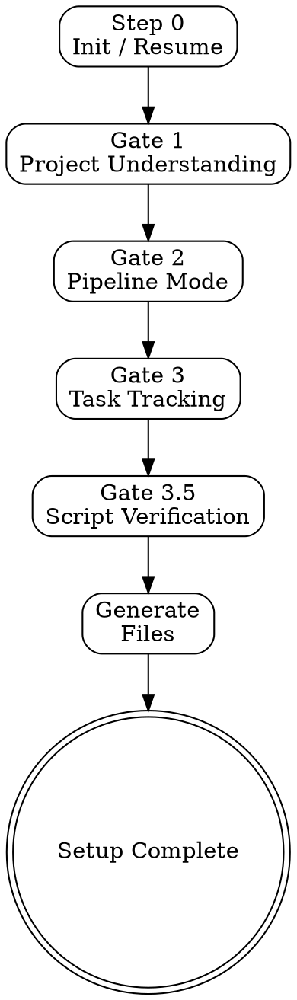

# Project Setup Wizard — pm-core Meta-Tool

## Overview

Analyze a project and generate customized dev-skills, agents, commands, and quality gates. Interactive wizard with 7 gates (Phase Alpha: Gates 1-3.5). Principle: generate once, run independently.

## Process

### Step 0: Initialize / Resume

Check for existing wizard state:

| Condition | Action |
|-----------|--------|
| No `.claude/pm-setup-state.yaml` | Create state file, add to `.gitignore`, start Gate 1 |
| State exists, gate incomplete | Resume from `current_gate` |
| State exists, all complete | Ask: re-generate or skip? |

Create initial state with platform detection:

    wizard_version: "0.1.0"
    started: {current_datetime}
    current_gate: 1
    platform:
      os: {uname -s result}
      shell: bash
      wsl: {true if microsoft in /proc/version}
      autocrlf: {git config core.autocrlf}
    gates: {}

Add to `.gitignore` if not present: `.claude/pm-setup-state.yaml` and `.claude/pm/`.

Reference files for this skill are in `references/` relative to this skill's directory.

### TodoWrite Plan

Create at initialization:
- [ ] Gate 1: Architecture audit completed and confirmed
- [ ] Gate 2: Pipeline mode selected
- [ ] Gate 3: Task tracking configured
- [ ] Gate 3.5: Scripts verified and tested
- [ ] Generation: All files created
- [ ] Cleanup: State file deleted

Update status as each gate completes.

### Gate 1: Project Understanding

Load `references/architecture-audit.md`.

1. Dispatch `architecture-auditor` agent
2. Collect structured audit results
3. Present to user:

       📊 Architecture Audit Results
       {audit output from agent}

       Is this correct? Anything to adjust?

4. Apply user corrections if any
5. Cache in state under `gates.1`:
   - `stack`, `arch`, `layers`, `existing_skills`, `conflict_zones`, `parallel_score`
6. Mark `gates.1.completed: true`, advance `current_gate: 2`

### Gate 2: Development Pipeline

Read `gates.1.parallel_score` from state.

**Score >= 5 (well-separated):**

    Your architecture supports parallel development.
    Sequential: Schema/Domain → Parallel: {layers} → Merge + Verify.
    Confirm? (yes / prefer sequential / adjust)

**Score 3-4 (mixed):**

Present options with trade-offs:
- A: Parallel with restrictions ({conflict_zones} serialized)
- B: Sequential (safe, slower)
- C: Refactor conflict zones first

**Score < 3:**

    Sequential recommended — architecture has significant coupling.
    Proceed? (yes / try parallel anyway)

Cache in state under `gates.2`:
- `mode` (parallel | sequential | parallel-restricted)
Mark `gates.2.completed: true`, advance `current_gate: 3`

### Gate 3: Task Tracking & Integrations

Load `references/backlog-strategies.md` and `references/standard-patterns.md`.

**Step 3.1 — Backlog location.** Present:
- A: BACKLOG.md only (no setup needed)
- B: GitHub Issues (requires gh CLI)
- C: Both GitHub + BACKLOG.md (recommended if gh available)
- D: Other tool (manual setup instructions)

**Step 3.2 — Tech/business split.** If user works with multiple task types:
- Technical → GitHub Issues or BACKLOG.md
- Business → user's choice

**Step 3.3 — Integration setup.**
For GitHub: run discovery commands from reference. Create labels. Verify access.
For BACKLOG.md: generate template at `.claude/pm/BACKLOG.md`.

**Step 3.4 — Generate scripts and commands.**
Based on discovered capabilities, generate from templates in reference:
- Scripts at `.claude/scripts/`:
  - `pm-sync.sh`, `pm-close.sh`, `test-setup.sh`
- Commands at `.claude/commands/`:
  - `pm-sync.md`, `pm-status.md`, `pm-close.md`
- `.claude/.gitattributes` with `*.sh text eol=lf`

Run `chmod +x` on all generated scripts.

Cache in state under `gates.3`:
- `backlog_mode` (backlog-md | github | both | other)
- `github_repo` (owner/name or null)
- `scripts_generated` (list of script names)
Mark `gates.3.completed: true`, advance `current_gate: 3.5`

### Gate 3.5: Script Verification

Load `references/script-testing.md`.

1. Dispatch `script-tester` agent
2. Agent runs: platform check → syntax → line endings → permissions → smoke tests
3. If all pass: proceed
4. If failures: agent iterates fix→retest (max 3 attempts)
5. If still failing after 3 attempts: report to user, offer manual fix or skip

Cache in state under `gates.35`:
- `scripts_tested` (count)
- `all_passed` (boolean)
Mark `gates.35.completed: true`

### Generation Summary

After all gates pass, present:

    ✅ pm-core Phase Alpha setup complete!

    Generated:
      Commands: {list}
      Scripts: {list}
      Config: .claude/pm/config.yaml

    Integrations:
      GitHub: {connected/not configured}
      BACKLOG.md: {path}

    Next steps:
      /pm:status — current state
      /pm:sync <issue> — sync to GitHub
      Phase Beta: re-run /pm:setup for dev-skills + agents

Delete `.claude/pm-setup-state.yaml` after success.

## Checklist

- [ ] Architecture audit completed and user-confirmed
- [ ] Pipeline mode selected (parallel/sequential)
- [ ] Backlog integration configured and verified
- [ ] Scripts generated with correct line endings (LF)
- [ ] All scripts pass syntax validation
- [ ] Integration smoke tests passed
- [ ] `.gitattributes` created
- [ ] `.gitignore` updated with `.claude/pm/`
- [ ] State file deleted after completion

## Self-Improvement Protocol

After each setup run:
1. **New stack not in audit patterns?** → Update `references/architecture-audit.md` detection rules
2. **Script test found platform issue?** → Update `references/script-testing.md` with fix
3. **User corrected audit results significantly?** → Review heuristics, add edge case to audit reference
4. **Structural issue with this skill?** → Invoke `skill-forge` in IMPROVE mode
