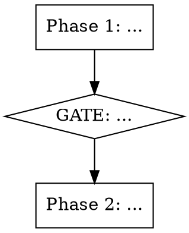

# Methodology: Orchestrator (Workflow / Multi-Phase Skills)

Use this methodology when creating skills that coordinate complex multi-phase processes, dispatch other skills, or manage parallel agents.
Examples: `implement-feature`, feature pipelines, release workflows, onboarding processes.

## Core Principle

"The orchestrator decides WHAT and WHEN, not HOW." Each phase delegates to specialized skills or agents. The orchestrator's job is routing, gating, and progress tracking.

## Process

### Step 1: Map Phases

Identify all phases the workflow needs. Draw the flow:



Rules:
- Each phase has a single clear responsibility
- Gates between phases where user confirmation needed
- Maximum 6-7 phases (split into sub-skills if more)

### Step 2: Define Gates

Gates are confirmation points before expensive or irreversible operations:

```markdown
**GATE after Phase N:** Present [findings/plan] to user. Proceed only with confirmation.
```

When to add a gate:
- Before code generation (user should approve the plan)
- Before external calls (API, deploy, publish)
- After analysis (user should confirm findings)
- Before skill dispatch (user should confirm which skills to invoke)

### Step 3: Wire Skill Dispatch

If the orchestrator invokes other skills:

```markdown
## Skill Dispatch

| Trigger | Skill | When |
|---------|-------|------|
| New tables needed | `migration` | Phase 2 |
| CQRS artifacts needed | `cqrs-scaffold` | Phase 3 |
| AI prompts changed | `ai-prompt-test` | Phase 5 |
```

Pattern for conditional dispatch:
```markdown
IF [condition confirmed in gate]:
  → Invoke `skill-name`
  → Wait for completion
  → Update todo
```

### Step 4: Plan TodoWrite

Orchestrators create all todos upfront for progress tracking:

```markdown
## TodoWrite Plan

Create at Phase 1:
- [ ] Phase 1: Understand requirements
- [ ] Phase 2: Design & plan
- [ ] Phase 3: Implement core
- [ ] Phase 4: Wire up
- [ ] Phase 5: Review
- [ ] Phase 6: Verify

Update status as each phase completes.
```

### Step 5: Define Subagent Dispatch (if needed)

For parallel background work:

```markdown
### Step 0: Dispatch Parallel Analysis

Launch subagents BEFORE starting main process:

| Agent | Type | Focus |
|-------|------|-------|
| `code-explorer` | Explore | Understand existing patterns |
| `security-reviewer` | security-reviewer | Check for vulnerabilities |

Collect results in Phase [N] before proceeding.
```

Step 0 pattern:
- Always numbered as Step 0 (runs before main process)
- Subagents run in background
- Results consumed in a later phase
- Main process continues while subagents work

## Structural Pattern

```markdown
# Skill Name

## Overview

## Process Overview
[Flowchart in dot notation]

## Phase 1: Understand
[TodoWrite: create all phase todos]
[GATE if needed]

## Phase 2: Plan
[Skill dispatch table if needed]
[GATE: user approves plan]

## Phase 3-N: Execute
[Steps with conditional skill invocation]

## Phase N+1: Review
[BLOCKER/WARNING/INFO if applicable]
[GATE: findings acceptable?]

## Phase N+2: Verify
[Docker verification]
[Final todo update]

## Skill Dispatch Table
## Checklist
## Self-Improvement Protocol
```
